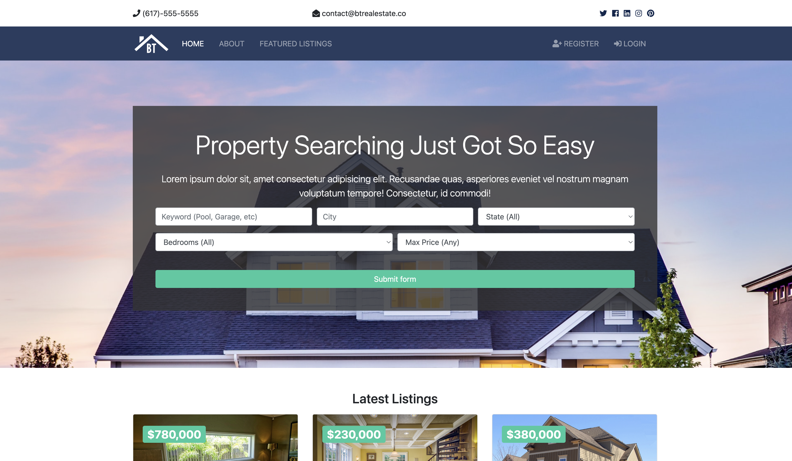
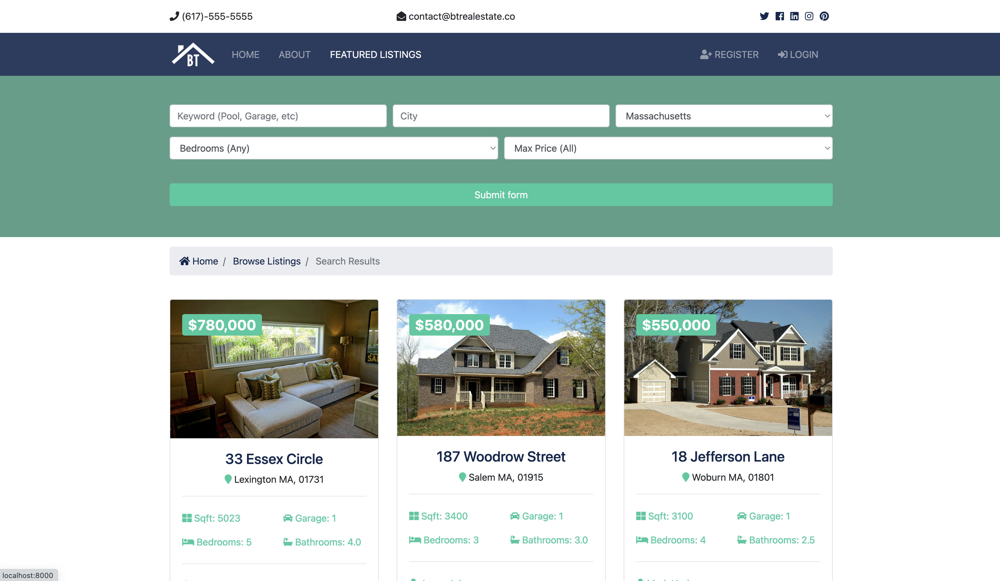
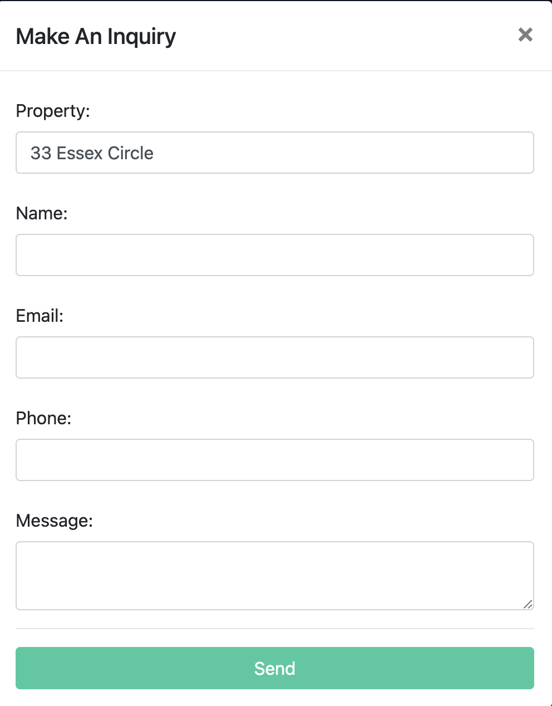
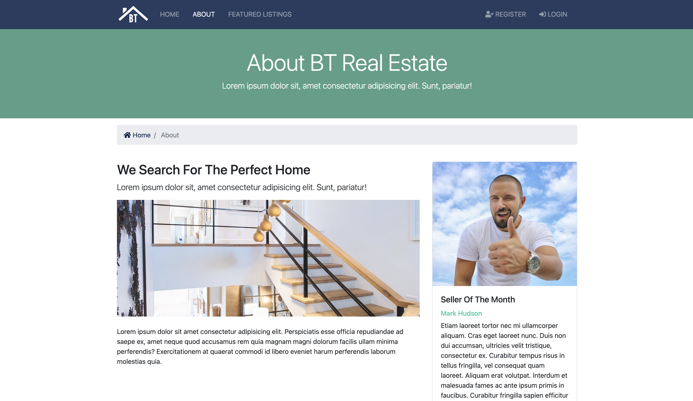
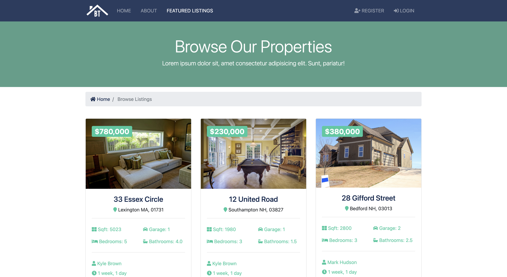
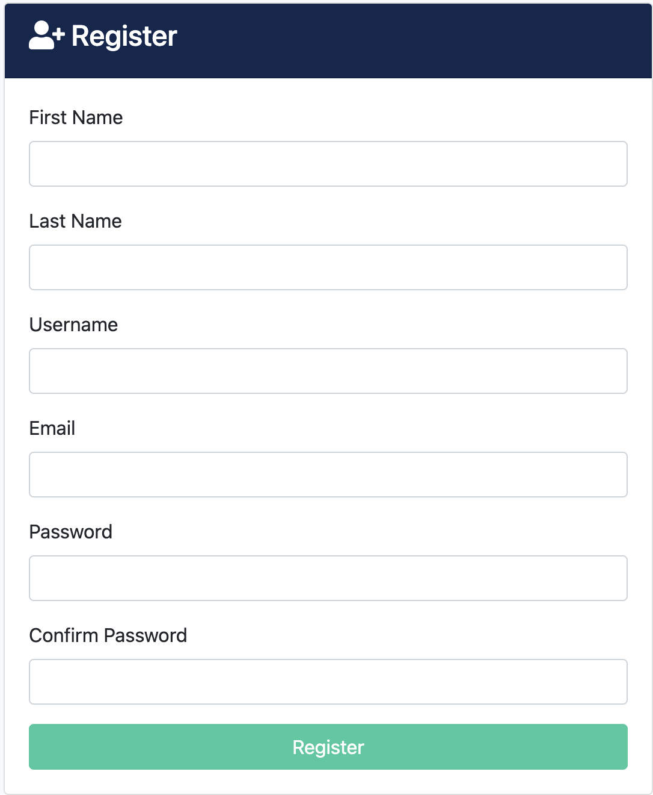
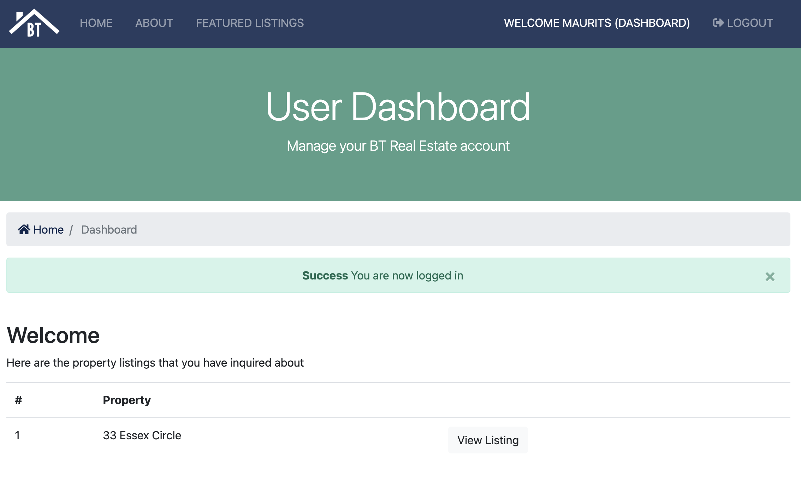
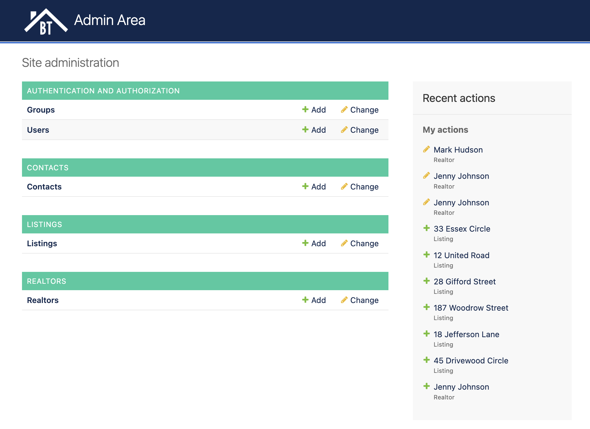

# Real estate website with Django 
This repository contains a real estate website written with Django and using Postgres as a backend. 

## Overview
The website is for a fictional real estate company, BT Real Estate, and has a range of features:

- Searching for listings and getting more information about each
- Making inquiries via email 
- Creating a user account that tracks your inquiries
- An admin area for staff to manage listings, realtors, etc.

## Walkthrough
### Landing page
The landing page looks as follows:

In the header, we have contact details and social media links. 

In the navigation bar, we can navigate to our other pages, namely About and Featured Listings, or Register for an account or Login.

The main functionality of the page is to search for properties depending on keywords, location, state, etc.

There are also some featured listings and there's a placeholder footer (not pictured).

### Searching
Now, let's search for properties in, say, Massachusetts. The page filters for porperties in Massachusetts, as you might expect. Additionally, one nice piece of functionality is that the search form remains prepopulated with the search query - "Massachusetts" is already filled in the search form to make it easy to refine the search, rather than having to start over again.

### Listings view
We'll have a look at the first listing, 33 Essex Circle. We get some pictures of the property as well as its main attributes.

You also get lightbox functionality for flicking through the pictures:

  
   

Finally, if you're interested in the property, you can make an inquiry. This will prepopulate the name of the property and send an inquiry email. If you're not logged in, you can still make an inquiry. If you are logged in, the inquiry will be saved on your account for you to view later.

### About and Featured listings
The About page and Featured listings are a bit more basic. The About page just has some information about the company, and Admins can set a seller of the month.

The Featured listings just shows six listings. The number of listings can be adjusted easily and pagination is available as well. 

### Registering and logging in
It's easy to sign up for an account. Clicing the Register page will open a registration form. The registration form will check whether the username already exists and whether the passwords match. 

Once logged in, you get a welcome message and are redirected to a user dashboard where you can see all the inquiries you've made. 

### Admin area

There's also an admin area available for superusers and staff where you can easily add, delete, and update users, groups, inquiries, listings, and realtors.

## Running the app
### Locally or remotely
I originally developed this app with a local Postgres server. If you decide to run locally, you need to edit `settings.py` and update the hostname of your database. You can of course also have a remote database server - also, just update the hostname and credentials.

Then you would need to collect static assets like `python manage.py collectstatic` and run migrations with python `manage.py migrate`.

### Container
I have also provided a containerised configuration. `docker-compose.yaml` has definitions for the main app as well as a postgres container.

The Django container has `django_entrypoint.sh` as its entrypoint. This script will collect all static files, apply migrations (which you may not want to do every time you run the container), and run the server. 

Also, the Django container is configured to wait until the postgres container is not just running, but is healthy, using `pg_isready -U postgres` as a health check. 

## Credits
This work is based on a Udemy course by Brad Traversy called Python Django Dev to Deployment.
